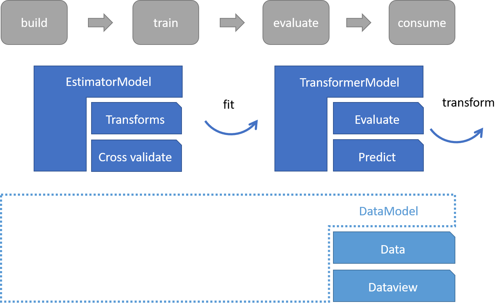

FSharpML a thin API to explore ML.Net in F#
===========================================

FSharpML is a lightweight API writen in F# on top of the powerful machine learning framework [ML.NET](http://dot.net/ml) library. It is designed to enable users to explore ML.Net in a scriptable manner and maintaining the functional style of F#.

|Branch|Ubuntu(trusty)|Windows|
|---|---|---|
| master |  |  |
| developer |  |  |

Current state
------------------

FSharpML is still in an experimental stage, but a nuget package is already available.
After installing the package via Nuget we can load the delivered reference script and start using ML.Net in conjunction with FSharpML.

We are planing to port all samples from the official site [Samples for ML.NET](https://github.com/dotnet/machinelearning-samples) within the comming days.
Current state is available [here](https://csbiology.github.io/FSharpML/).

Core functionality
------------------

A generic machine learning workflow consist of building the ML model, training the model on existing data and evaluate the quality. Lastly the model is consumed to predict new data.
In line with the design of [ML.NET](http://dot.net/ml), we designed FSharpML containing two complementary parts named EstimatorModel and TransformerModel covering the full machine lerarning workflow.
EstimatorModel contains the functionality to define the data transformation necessary to create and train the model. The 'fit' function in EstimatorModel applied on training data results into the TransformerModel that represents the trained model able to transform other data of the same shape.

Documentation
-------------

Functions, types and Classes contained in FSharpML come with short explanatory description, which can be found in the [API Reference](https://csbiology.github.io/FSharpML/reference/index.html).

More indepth explanations, tutorials and general information about the project can be found [here](http://csbiology.github.io/FSharpML).

The documentation and tutorials for this library are automatically generated (using the F# Formatting) from *.fsx and *.md files in the docs folder. If you find a typo, please submit a pull request!

Contributing
------------

Please refer to the [Contribution guidelines](.github/CONTRIBUTING.md)

